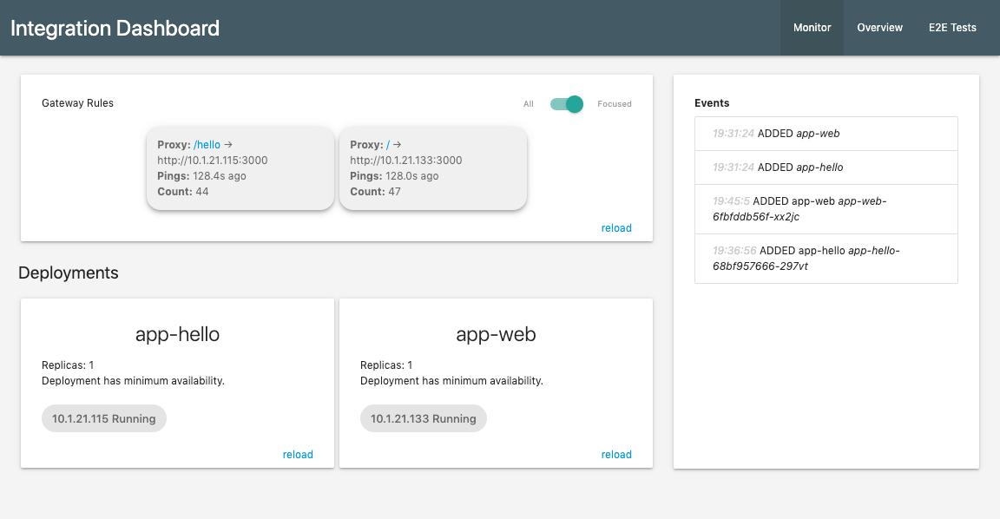

# Archean : A Microservice Playground

Archean is a minimalistic microservices demo application designed to provide a space to experiment and learn. 
It resolves initial setup and configuration pain, without being opinionated about your future stack and architecture.

This project also helps to learn Docker and Kubernetes basics. Pre-requisites are, you know a little bit about 
NodeJS and Express. Feel free to fork it with another language / stack, there is nothing specifc to Node.

#### Guiding principels

- minimal dependencies and assumptions
- lightweight on resources
- simple to understand and easy to modify
- testable; encourages TDD
- follows and encourages best practices
- resilient and scalable

Archean was an eon in Earth history, back when all living things were pretty simple.   

## Setup

**Note**: do not run it in production - security 
was not a main concern, it is a learning and testing project!

This demo is meant to run under [Kubernetes](https://www.docker.com/blog/kubernetes-is-now-available-in-docker-desktop-stable-channel/) using build-in [Kustomize](https://kustomize.io/) and [Skaffold](https://skaffold.dev/docs/quickstart/). All you need is to run 
```
skaffold dev
```
at the root of this project and start fiddling with the code, while things deploy, self-destruct, self-test etc.

Once skaffold pulls the images and starts them, open your browser to http://localhost:30000.
By default you will land at a simple monitoring page that looks like this (see code in [monitor-archean](/monitor-archean/src/public)):

 
In case port 30000 is already used, you can change it in `api-gateway/k8s/service.yaml` (nodePort).

If you do not have it all installed and are on MacOS:
```
brew cask install docker
brew install skaffold
```
then you will find Docker in Applications, you need to start it and login. 

If you already have Skaffold installed, please, ensure the version is 1.0.0+.

## Architecture

```
                          +--http--> [micro1]    ->---heartbeat---+
                          |                                       |
(internet)  -->  [api-gateway]                   <------------- [redis]
                          |                                       |
                          +--http--> [micro2]    ->---heartbeat---+

```

Note that all of the services are stateless and you can change number of replicas in deployment.yaml for all
components without loosing the functionality. This way you can achieve HA or horizontal scalability. 
   
## Build and deployment workflow

Directories are organized with a microservice per directory. I.e. it is a flat monorepo.

Skaffold is a tool that takes care of building, packaging and deploying your microservices, while also syncing the code
in development mode so that you don't need to constantly restart containers. For each artifact, it follows the 
pipeline below.

1. Build

   Uses `<module>/Dockerfile`, and produces a Docker image
2. Tag

   Tags images according to skaffold.yaml/build.artifacts.image name
3. Deploy

   Deploys each artifact according to kustomization.yaml into pods and services, such that each micro gets its own IP 
   address and you can experiment with scaling and tuning.
4. File Sync

   Once you change anything in sub-directories, it syncs up, performing minimal number operations from steps 1-3 to bring
   it to the same state as if you rebuilt and redeployed everything. 
5. Cleanup

   Once you Ctrl+C your `skaffold dev`, everything is stopped and removed from the kube.
   
## Exercises

### Create your own microservice

1. Copy `/micro-query` directory to a new directory of your choice, say `/micro-foo`
2. Rename appname in package.json and k8s/deployment.yaml (there are 5 spots)
3. Add your `/foo` to `./kustomization.yaml|resources` as `- foo/k8s/deployment.yaml`
4. Copy-paste one of the `build.artifacts` in `skaffold.yaml` and change it to `/foo`
5. Adjust index.js to your liking

If not yet running, run `skaffold dev` and hit http://localhost:30000/foo (adjust the path in index.js:19 `publish()` 
if you want)

### Make redeployment faster with file sync and nodemon

1. Add `"nodemon": "^1.19.4"` to the micro's package.json
2. Add `"dev": "nodemon src/index.js"` to package.json scrips
3. Switch your micro to run under nodemon in respective Dockerfile by using `CMD npm run dev`
4. Add the following to `skaffold.yaml`'s build.artifact under `context`:

   ```
    - image: <micro>
      context: ./<micro>/
      sync:
        manual:
          - src: 'src/**/*.js'
            dest: .
   ```